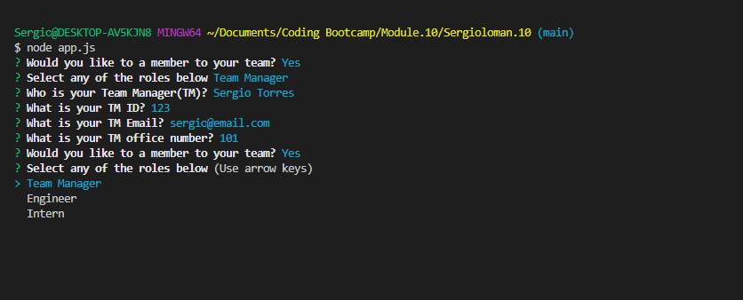
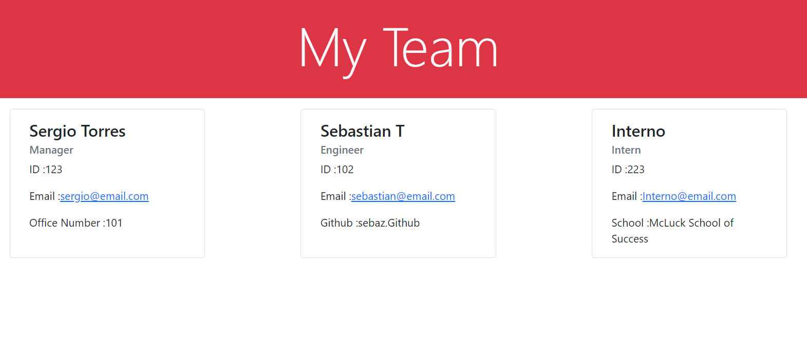

# Team Generator 

Welcome to TeamGenerator, a node application that can help you create and display your team information into a website just by answering a few prompts in the terminal.

## Contents

* [Requirements](#requirements)
* [Installation](#installation)
* [Features](#features)
* [Test](#test)
* [Bonus](#bonus)

## Requirements

[Node.Js](https://nodejs.dev/) : 
Node is our main tool here and allows us to use javascript and communicate with our command line

## Installation

Copy this repository in your your destination of choice. Then run the *npm install* command in your terminal. This will download the Inquirer and Jest packages needed to operate the program.

## Features

* ### pageGenerator.js
This page is responsible for rendering most of the content seein in our final HTML. Its achieves that by creating functions that return Template Literals, which then we can use to create our site using *bootstrap5*

PageGenerator.js creates a card for each employee added, saves them in form of variables, and passes them to an array which is then used to create the body of our html.

* ### app.js
The apps.js file contains the main features of our program. It handles all the promots using inquirer and then its responsible for creating the final "teams.html" file. 

Please be sure to read the coments in the file for more information!

## Test

*  Our application leans heavily on Object Oriented Programing; essentiall, each one of our employee profiles are constructor objects with properties and functions on their own that we need to be sure operate optimaly before creating new instances of them.

Thanks to Jest, we are able to create test for each one of our constructs. Please see the "test" folder in the repository to find the testing files.

Once you are in the 'test' directory, you can run the npm test command to execute Jest, and see how our constructs pass the test. 

## Contribute

* we are always improving our code. If you have any suggestions on how to make our program more efficient or DRY, please us a message through Github or at [via email](sergio@email.com) and we will get back to you.

## Bonus

Want to see how it works? Check out this [walktrough-video](https://drive.google.com/file/d/1SGzktq-eH-5xhCfImkymz_QEdGJP_ise/view) to see the app in actiuon!

git